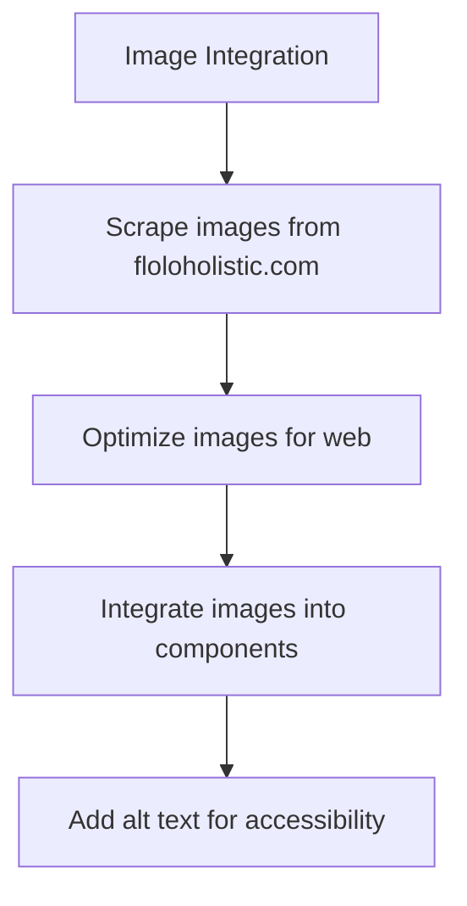
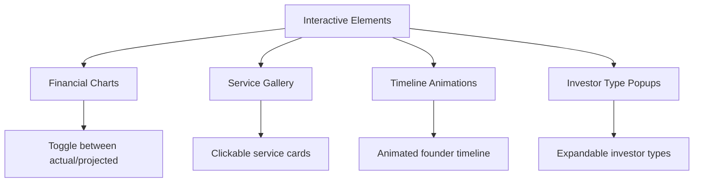
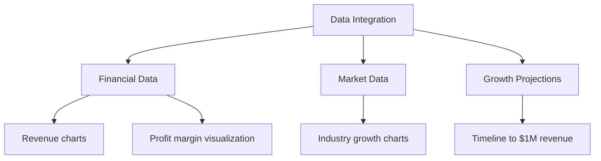
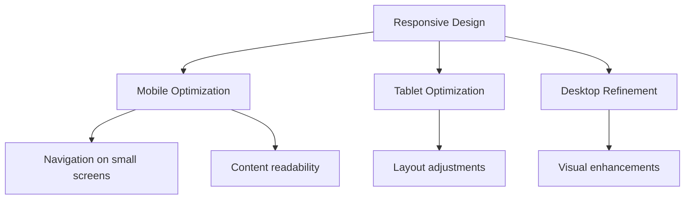
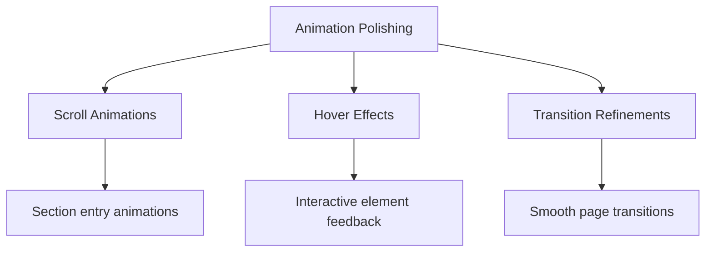
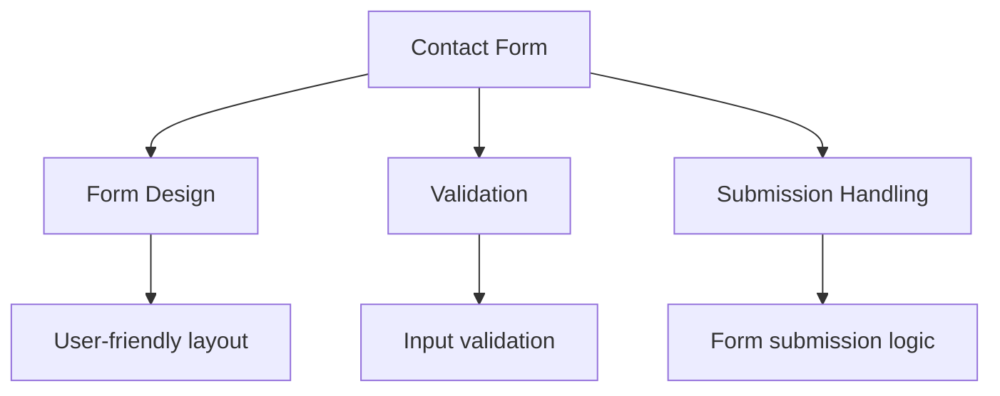
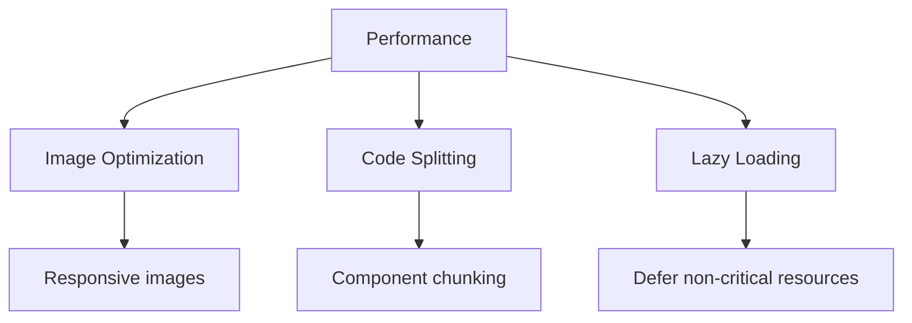
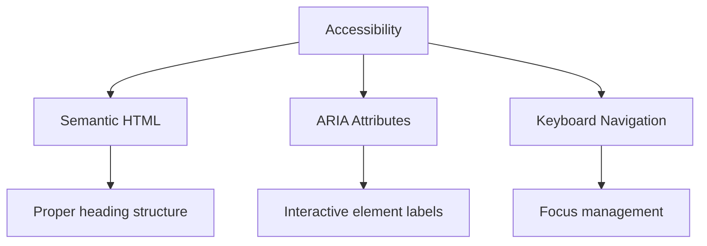

# FloLo Pitch Deck - Comprehensive Development Plan

Based on analysis of the project files and the detailed project outline, this is a comprehensive plan for moving forward with the FloLo Holistic pitch deck website. The basic structure is already in place, but there are several areas that need attention to create a polished, professional pitch deck that meets all the requirements.

## 1. Current Status Assessment

The project has a solid foundation with:
- Next.js framework with TypeScript
- Tailwind CSS for styling
- Framer Motion for animations
- React Intersection Observer for scroll-based animations
- Chart.js for data visualization
- Basic section components created
- Navigation and layout structure in place

## 2. Key Areas for Development

### 2.1 Image Integration

- **Priority: High**
- The public/images directory exists but appears empty
- Need to scrape high-quality images from floloholistic.com as specified in the project outline
- Images needed for:
  - Hero background in Executive Summary
  - Service illustrations in About FloLo
  - Founder photo in Founder Spotlight
  - Background imagery throughout the site

### 2.2 Interactive Elements Enhancement

- **Priority: High**
- Implement toggleable financial charts (actual vs. projected)
- Enhance the service gallery in About FloLo section
- Create animated timelines for company history and founder
- Add interactive popups for investor types
- Implement fund allocation visualization in Growth Strategy

### 2.3 Data Integration & Visualization

- **Priority: Medium**
- Create a data directory structure for organizing financial and market data
- Implement Chart.js visualizations for:
  - 2024 revenue and profit data
  - Projected growth to 2027
  - Market opportunity data
  - Fund allocation visualization

### 2.4 Responsive Design Refinement

- **Priority: Medium**
- Test and refine responsive behavior across all device sizes
- Ensure navigation works well on mobile devices
- Optimize content layout for different screen sizes
- Ensure interactive elements work well on touch devices

### 2.5 Animation & Transition Polishing

- **Priority: Medium**
- Refine scroll-based animations for smoother transitions
- Add subtle hover effects for interactive elements
- Ensure animations enhance rather than distract from content
- Implement consistent animation patterns across sections

### 2.6 Contact Form Implementation

- **Priority: High**
- Implement a functional contact form in the Contact Us section
- Add form validation for required fields
- Create a submission handler (could be serverless function or API route)
- Add success/error feedback for form submissions

### 2.7 Performance Optimization

- **Priority: Low** (can be addressed later in development)
- Optimize images for faster loading
- Implement lazy loading for below-the-fold content
- Ensure smooth performance with animations
- Test and optimize for Core Web Vitals

### 2.8 Accessibility Improvements

- **Priority: Medium**
- Ensure proper semantic HTML throughout
- Add ARIA attributes where needed
- Test keyboard navigation
- Ensure sufficient color contrast
- Add alt text for all images

## 3. Implementation Approach

### Phase 1: Content & Visual Foundation
1. Scrape and integrate images from floloholistic.com
2. Refine content in all sections to match the project outline
3. Implement basic animations and transitions

### Phase 2: Interactive Elements
1. Develop financial charts and data visualizations
2. Implement interactive service gallery
3. Create animated timelines
4. Add investor type interactive elements

### Phase 3: Functionality & Polish
1. Implement contact form with validation
2. Refine responsive design across all breakpoints
3. Optimize performance and accessibility
4. Final testing and bug fixes

## 4. Technical Considerations

### Data Management
- Create structured data files for financial information
- Implement data fetching utilities

### Component Architecture
- Refine reusable components for consistency
- Ensure proper prop typing with TypeScript

### Styling Approach
- Maintain consistent use of Tailwind utility classes
- Consider extracting common patterns to custom components

### Animation Strategy
- Use Framer Motion for complex animations
- Ensure animations are performant on mobile devices

## 5. Next Steps

1. **Immediate Actions:**
   - Scrape images from floloholistic.com
   - Create a data directory with structured financial data
   - Enhance the Executive Summary section with proper imagery

2. **Short-term Goals:**
   - Implement interactive financial charts
   - Develop the service gallery in the About FloLo section
   - Refine responsive design for mobile devices

3. **Medium-term Goals:**
   - Implement all interactive elements
   - Create the contact form functionality
   - Polish animations and transitions

4. **Final Steps:**
   - Comprehensive testing across devices
   - Performance optimization
   - Accessibility review

## 6. GitHub Repository

The project is also available on GitHub at:
https://github.com/joelgranik/flolo_pitch_deck.git

All changes should be synchronized between the local development environment and the GitHub repository.